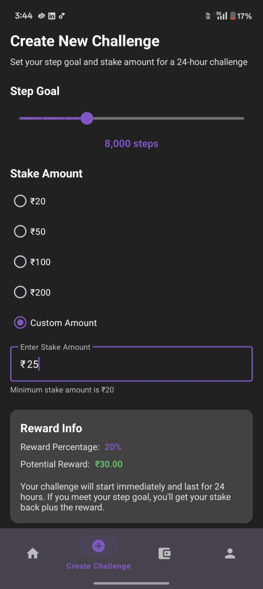
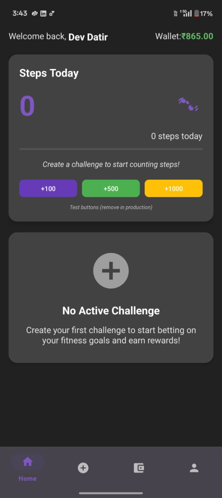
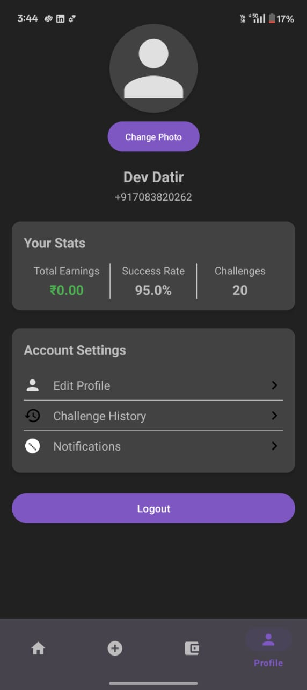
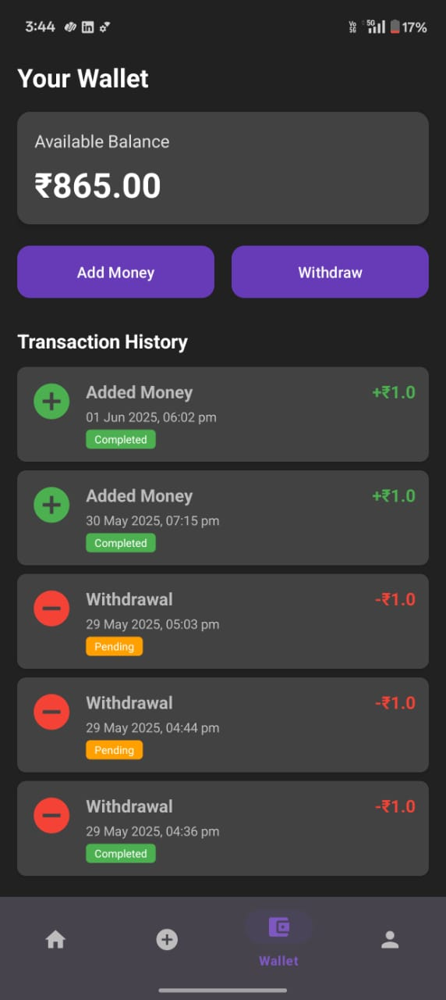

# StepBet 🚶💰

StepBet is a Kotlin-based Android fitness app that lets users bet real money on their daily step goals. If the user completes the step challenge within 24 hours, they win back their stake with a reward!

<div align="center">
  
  
  
  
</div>

---

## 🔑 Features

- ✅ **Login/Signup with OTP (Firebase Authentication)**
- 🏃 **Step Challenge System:** Set a 24-hour step goal and stake amount
- 💰 **Real Money Staking and Rewards**
- 💳 **Razorpay Integration** for:
  - Adding money
  - Withdrawing earnings
- 📈 **Step Tracker Dashboard**
- 📊 **Profile Statistics:**
  - Success Rate
  - Challenge Count
  - Total Earnings
- 🔁 **Transaction History & Wallet Overview**

---

## ⚙️ Tech Stack

| Technology      | Purpose                                |
|------------------|----------------------------------------|
| Kotlin           | Native Android development             |
| Firebase Auth    | OTP-based user login/sign-up           |
| Firebase Firestore | Backend database for challenges, users |
| Razorpay         | Real money transactions (Add/Withdraw) |
| Step Counter API | Counting daily physical steps          |

---


## 🚀 Getting Started

### Prerequisites

- Android Studio Flamingo or newer
- Firebase project with:
  - Authentication (Phone)
  - Firestore Database
- Razorpay account & API keys
- Internet & step counter permission in AndroidManifest

### Installation

```bash
git clone https://github.com/DevDatir/StepBet.git
